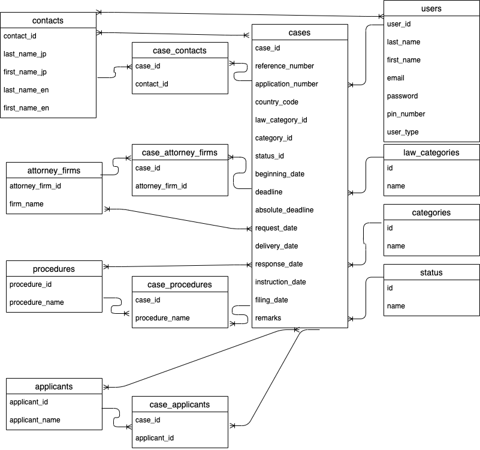
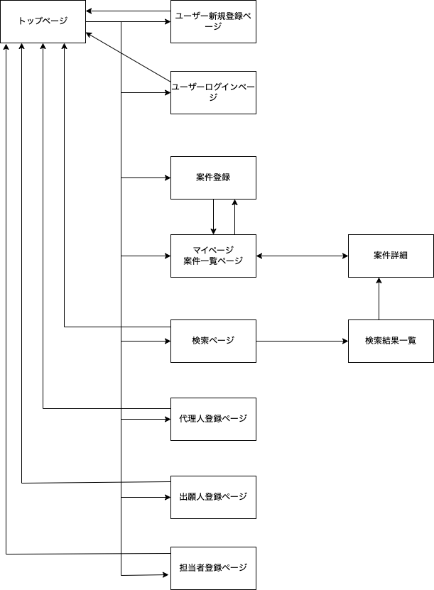

# アプリケーション名
ProjectBuddy

# アプリケーション概要
**ProjectBuddy**は、案件を登録し、自分の担当案件を効率的に管理するためのアプリケーションです。

# URL
https://projectbuddy-2uah.onrender.com

# テスト用アカウント
* Basic認証ID: admin
* Basic認証Pass: LPH69enE
* メールアドレス: test@test.com
* パスワード: 111aaa

# 利用方法
## 案件登録
1. **トップページのヘッダー**からユーザー新規登録を行う。
2. **案件登録**をクリックし、以下の情報を入力して案件を登録する。
  - 案件番号
  - 出願番号
  - 国コード
  - 社内担当者
  - 四法区分
  - 区分
  - 状況
  - 起算日
  - 期限日
  - 法定期限日

## マイページ
1. **トップページ**からマイページに遷移すると、自分が担当している案件を確認できる。
2. **未処理案件一覧**と**報告待ち一覧**を表示し、それぞれの状況を確認できる。 
  - **未処理案件一覧**: 自分の対応が完了していない案件を表示します。 
  - **報告待ち一覧**: 自分の対応は完了しているが、他者からの報告を待っている案件を表示します。
3. 案件番号をクリックすると**案件詳細画面**に遷移し、詳細情報を確認できる。

# アプリケーションを作成した背景 
現在の職場では、会社全体で使用している案件管理用のデータベースがあります。しかし、このデータベースは以下の理由で、案件管理には十分適していない。

 - 案件や国ごとに発行される書類が多岐にわたるため、国・書類ごとの異なる期限を効率的に管理できない。
 - そのため、各担当者が個別にエクセルなどを使って案件を管理している。

## エクセルを使用した場合の課題
 - 管理項目が多く、1つの画面にまとめて表示することが難しい。
 - 入力作業や案件確認作業に時間がかかる。

## 市場に存在するツールの課題
 - 市販の案件管理データベースの中には、要件を満たすものもありましたが、初期費用が高額。
 - 現在、社内共通のデータベースが存在している以上、新たに高額なシステムを導入することは難しい。

## 開発の動機
そこで、既存の高機能データベースよりも性能は劣るものの、エクセルよりは効率的で管理しやすいツールを自作することで、現状の課題を解決したいと考えた。

# 実装した機能についての画像やGIF及びその説明

# 実装予定の機能
現在、担当者登録機能を実装中です。 
以下の項目についても今後実装する予定です。
 - 出願人登録機能
 - 内容登録機能
 - 検索機能
 - 案件編集機能
 - 案件削除機能

## データベース設計

# 画面遷移図

# 開発環境
* フロントエンド
* バックエンド
* インフラ
* テスト
* テキストエディタ
* タスク管理

# ローカルでの動作方法
以下のコマンドを順に実行。
% gid clone https://github.com/Ay00Mo/projectbuddy.git
% cd xxxxxxx
% bundle install
% rails db:create
% rails db:migrate

# 工夫したポイント
## 1. ユーザーごとの案件管理を効率化した
- 未処理案件一覧と報告待ち一覧を分けて表示することで、ユーザーが優先的に対応すべき案件を一目で確認できるようにした。
- 担当案件の状態を簡単に管理できるインターフェースを提供し、日々の作業効率を向上させた。

## 2. 柔軟なデータ入力設計を実現した
- 各案件に必要な情報（例: 案件番号、出願番号、国コード、期限日など）を詳細に登録できるようにした。
- 国や書類ごとに異なる期限管理を容易にするため、入力フィールドを柔軟に設計した。

## 3. 直感的なUI設計を行った
- ユーザーが迷わず操作できるよう、画面遷移をシンプルにした。
- マイページから担当案件や案件詳細にすぐアクセスできる構造を採用した。

## 4. データの一元管理を実現した
- エクセルの煩雑さを解消するため、案件情報を一元的に管理できるデータベースを設計した。
- 必要なデータをすぐに確認できるようにし、手作業によるミスや確認作業の手間を削減した。

## 5. コスト意識を反映した開発を行った
- 市場の高額な案件管理ツールを参考にしつつ、現状の課題にフォーカスしたシンプルで実用的なツールを低コストで実現した。
- 社内の既存システムと競合しないよう、補完的な機能に特化した。

## 6. 将来的な拡張性を意識した設計を採用した
- 今後の要件変更や機能追加に対応できるよう、コードとデータベースの構造をモジュール化した。
- チーム内で共有・改善しやすい設計を心掛けた。